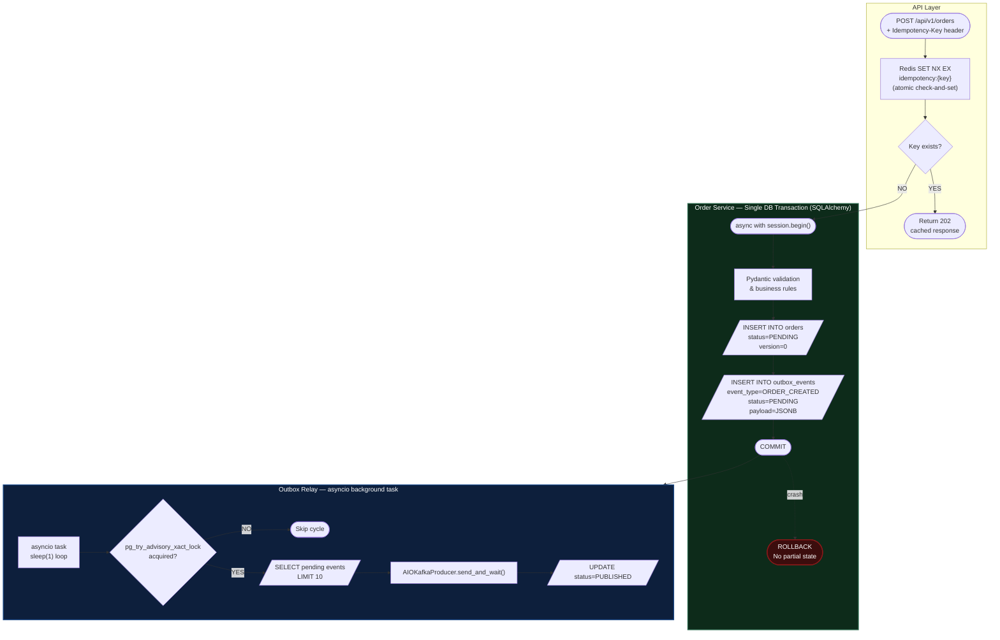
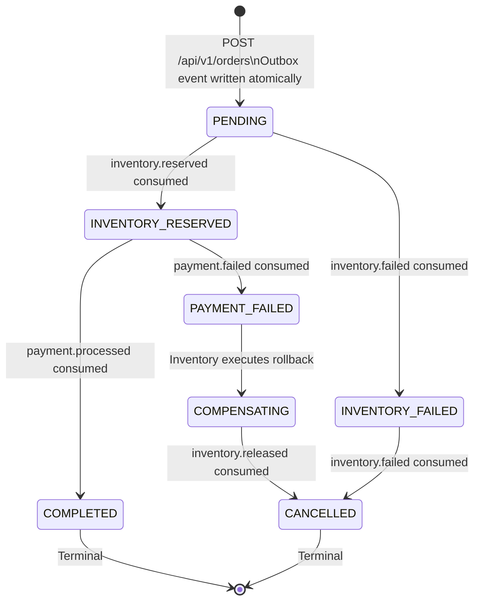

# Order Processing System — Python / FastAPI Edition

### A Production-Grade Event-Driven Microservices Architecture

---

## Table of Contents

1. [Project Overview](#project-overview)
2. [Architecture Philosophy](#architecture-philosophy)
3. [System Architecture](#system-architecture)
4. [Service Breakdown](#service-breakdown)
5. [Distributed Patterns Deep Dive](#distributed-patterns-deep-dive)
6. [Data Architecture](#data-architecture)
7. [Kafka Topic Design](#kafka-topic-design)
8. [Event Envelope Specification](#event-envelope-specification)
9. [Observability Strategy](#observability-strategy)
10. [Resilience Strategy](#resilience-strategy)
11. [Local Development Setup](#local-development-setup)
12. [API Reference](#api-reference)
13. [Tech Stack](#tech-stack)

---

## Project Overview

This system is a fully event-driven, microservices-based order processing platform built to production-grade standards. It handles the complete lifecycle of an e-commerce order — from creation through inventory reservation and payment capture to final confirmation — using asynchronous event choreography across independent, isolated services.

The core engineering challenge this system solves is **distributed consistency without distributed transactions**. Each service owns its data exclusively. No service calls another over HTTP at runtime. Consistency is achieved through the Saga pattern, compensating transactions, and strict idempotency guarantees at every message boundary.

This is a **polyglot architecture** — four services are built in Python with FastAPI, and the Notification Service is built in Go. The language choice for each service is deliberate: Go's goroutine concurrency model is better suited to the Notification Service's purely I/O-bound, high-throughput consumption workload.

**What this system demonstrates end-to-end:**

- Atomic event publication using the Transactional Outbox Pattern, eliminating the dual-write problem entirely
- Distributed saga choreography across three independent business domains
- Two-layer idempotency (Redis + database constraints) protecting every Kafka consumer from duplicate processing
- Optimistic locking preventing inventory oversell under concurrent load
- Compensating transactions automatically restoring consistency when payment fails
- Full distributed tracing with a single correlation ID flowing from HTTP ingress through every Kafka hop
- Circuit breakers and retry policies preventing cascade failures
- Polyglot microservices — Python/FastAPI for domain-heavy services, Go for the high-throughput I/O consumer

---

## Architecture Philosophy

### Why Event-Driven over REST Orchestration

A synchronous REST-based architecture would require the Order Service to directly call Inventory Service and Payment Service over HTTP. This creates three critical problems:

**Temporal coupling**: if Inventory Service is down, Order Service cannot function — even though creating an order and reserving inventory are logically separable concerns.

**Cascading failures**: a slow Payment Service response blocks Order Service async workers, which backs up the request queue, which cascades to the client.

**Tight deployment coupling**: every service must be deployed and healthy simultaneously.

The event-driven approach inverts this. Order Service writes its intent to Kafka and returns immediately. Inventory Service processes that intent when it is ready. Each can be deployed, scaled, and restarted independently.

### Why Choreography over Orchestration

An orchestrated saga requires a central coordinator that becomes a single point of failure and a bottleneck. Choreography distributes the coordination logic into each service. Each service knows what events to react to — no service has global knowledge of the flow. The workflow emerges from the combination of reactions.

The tradeoff is that the overall flow is harder to visualise from any single service's code — which is precisely why the sequence diagrams and this documentation exist.

### Why Go for Notification Service

Notification Service is a pure I/O-bound consumer with no database and no complex business logic. Go goroutines handle thousands of concurrent I/O operations with ~2KB of stack versus Python's GIL-constrained threading model. The compiled binary starts in under 100ms and idles at ~15MB.

### Why FastAPI for Business Services

FastAPI is the correct Python choice for production microservices:
- **Async-first**: built on Starlette/asyncio — handles concurrent requests without threads
- **Automatic OpenAPI docs**: `/docs` endpoint generated from type annotations
- **Pydantic v2**: schema validation, serialisation, and type safety in one library
- **Performance**: comparable to NodeJS, significantly faster than Flask/Django for I/O-bound work
- **Production-grade**: used at Uber, Netflix, and Microsoft internally

---

## System Architecture

### High-Level Component Topology

```mermaid
graph TB
    subgraph CLIENT["Client Layer"]
        C(["fa:fa-user Client / Mobile App"])
    end

    subgraph GATEWAY["API Gateway Layer  •  FastAPI + Nginx"]
        GW["API Gateway\n────────────────\n› Route Resolution\n› Rate Limiting (Redis)\n› Correlation ID Injection\n› API Key Validation"]
    end

    subgraph SERVICES["Microservices Layer"]
        direction TB

        subgraph OS_BOX["Order Service  •  Python / FastAPI  •  :8081"]
            OS["Order Service\n────────────────\n› Create Order\n› Outbox Poller\n› Status Updater"]
        end

        subgraph IS_BOX["Inventory Service  •  Python / FastAPI  •  :8082"]
            IS["Inventory Service\n────────────────\n› Reserve Stock\n› Release Stock\n› Optimistic Locking"]
        end

        subgraph PS_BOX["Payment Service  •  Python / FastAPI  •  :8083"]
            PS["Payment Service\n────────────────\n› Process Payment\n› Refund Payment\n› Idempotency Guard"]
        end

        subgraph NS_BOX["Notification Service  •  Go  •  :8084"]
            NS["Notification Service\n────────────────\n› Email Dispatch\n› SMS Dispatch\n› Terminal Event Listener\n› Goroutine-based concurrency"]
        end
    end

    subgraph MESSAGING["Messaging Layer  •  Apache Kafka Cluster (KRaft)"]
        direction LR
        T1[["order.created"]]
        T2[["inventory.reserved"]]
        T3[["inventory.failed"]]
        T4[["payment.processed"]]
        T5[["payment.failed"]]
        T6[["inventory.released"]]
        DLQ1[["inventory.events.DLQ"]]
        DLQ2[["payment.events.DLQ"]]
    end

    subgraph DATA["Data Layer"]
        direction TB

        subgraph ODB["orders_db  •  PostgreSQL :5432"]
            OT[("orders\norder_items\noutbox_events")]
        end

        subgraph IDB["inventory_db  •  PostgreSQL :5433"]
            IT[("products\ninventory_reservations")]
        end

        subgraph PDB["payments_db  •  PostgreSQL :5434"]
            PT[("payments")]
        end

        REDIS[("Redis :6379\n────────────\nIdempotency Keys\nRate Limit Counters")]
    end

    subgraph OBS["Observability Stack"]
        PROM["Prometheus\n:9090"]
        GRAF["Grafana\n:3000"]
        JAEGER["Jaeger\n:16686"]
    end

    C -->|"HTTPS + Idempotency-Key header"| GW
    GW -->|"POST /api/v1/orders"| OS
    GW -->|"Rate limit state"| REDIS
    OS -->|"Atomic write\n(same transaction)"| OT
    OS -->|"Publishes via Outbox Poller"| T1
    OS -->|"Consumes to update status"| T3
    OS -->|"Consumes to update status"| T4
    OS -->|"Consumes to update status"| T5
    OS -->|"Consumes to update status"| T6
    IS -->|"Reads/writes stock"| IT
    IS -->|"Consumes"| T1
    IS -->|"Publishes on success"| T2
    IS -->|"Publishes on failure"| T3
    IS -->|"Consumes for rollback"| T5
    IS -->|"Publishes after compensation"| T6
    IS -->|"Max retries exceeded"| DLQ1
    PS -->|"Reads/writes payments"| PT
    PS -->|"Consumes"| T2
    PS -->|"Publishes on success"| T4
    PS -->|"Publishes on failure"| T5
    PS -->|"Max retries exceeded"| DLQ2
    NS -->|"Consumes terminal events"| T3
    NS -->|"Consumes terminal events"| T4
    NS -->|"Consumes terminal events"| T5
    OS & IS & PS -->|"Idempotency key check"| REDIS
    OS & IS & PS & NS -->|"Metrics /metrics"| PROM
    PROM --> GRAF
    OS & IS & PS -->|"Trace spans"| JAEGER
```



---

## Service Breakdown

### API Gateway — Port 8080 — Python / FastAPI + Nginx

The single ingress point for all client traffic.

**Responsibilities:**
- Route resolution to downstream services via reverse proxy (Nginx) or FastAPI HTTPx client
- Rate limiting per IP using Redis
- Correlation ID injection — generate UUID if `X-Correlation-ID` absent
- Idempotency-Key validation on state-mutating endpoints

**Note on Python API Gateway:** Unlike Spring Cloud Gateway (reactive, built-in), the Python equivalent is either a lightweight FastAPI service acting as a reverse proxy using `httpx.AsyncClient`, or Nginx in front of the services with a thin FastAPI middleware layer. For this project, use the FastAPI reverse proxy approach for maximum learning value.

---

### Order Service — Port 8081 — Python / FastAPI

The entry point for business logic. Owns `orders_db` exclusively.

**Responsibilities:**
- Accept `POST /api/v1/orders`
- Validate request payload and `Idempotency-Key` header
- Execute the transactional outbox write using SQLAlchemy within a single database transaction
- Run the Outbox Poller as a background asyncio task with PostgreSQL advisory lock
- Consume terminal-state Kafka events to update order status

**Key design constraint:** Returns `202 Accepted` — the outcome is unknown at response time.

**Tables owned:** `orders`, `order_items`, `outbox_events`

---

### Inventory Service — Port 8082 — Python / FastAPI

**Responsibilities:**
- Consume `order.created` via aiokafka consumer
- Reserve stock using optimistic locking (version column + conditional UPDATE)
- Publish `inventory.reserved` or `inventory.failed`
- Consume `payment.failed` and execute compensating transaction
- Publish `inventory.released` after compensation

**Tables owned:** `products`, `inventory_reservations`

---

### Payment Service — Port 8083 — Python / FastAPI

**Responsibilities:**
- Consume `inventory.reserved` via aiokafka consumer
- Two-layer idempotency: Redis `SET NX EX` + UNIQUE constraint on `order_id`
- Mock payment processing (80% success rate)
- Publish `payment.processed` or `payment.failed`
- Circuit breaker via `tenacity` or `circuitbreaker` library

**Tables owned:** `payments`

---

### Notification Service — Port 8084 — Go

Same as described in Go documentation. Stateless, pure consumer, no database. See Go service documentation for implementation details.

---

## Distributed Patterns Deep Dive

### The Transactional Outbox Pattern



#### Python-Specific Implementation Notes

**SQLAlchemy async session as the transaction boundary:**
```python
async with async_session() as session:
    async with session.begin():          # single ACID transaction
        session.add(order)
        session.add(outbox_event)
        # COMMIT on __aexit__ — ROLLBACK on exception
```

**Advisory lock via raw SQL:**
```python
result = await session.execute(
    text("SELECT pg_try_advisory_xact_lock(:lock_id)"),
    {"lock_id": 72857438}
)
acquired = result.scalar()
```

**AIOKafka producer for async Kafka publishing:**
```python
await producer.send_and_wait(
    topic=event.kafka_topic,
    key=event.kafka_key.encode(),
    value=event.payload.encode()
)
```

---

### Idempotency — Two-Layer Defence

**Layer 1 — Redis atomic SET NX EX:**
```python
acquired = await redis.set(
    f"idempotent:inventory:{event_id}",
    "1",
    nx=True,      # SET only if Not eXists
    ex=86400      # expire after 24 hours
)
if not acquired:
    logger.info("Duplicate event — skipping", event_id=event_id)
    return
```

**Layer 2 — PostgreSQL UNIQUE constraint:**
`inventory_reservations.order_id UNIQUE` and `payments.order_id UNIQUE`. Duplicate insert raises `IntegrityError` — catch it, treat as successful no-op.

---

## Data Architecture

### Database-per-Service Pattern

Each service owns its own PostgreSQL instance. No shared schemas. No cross-database queries. SQLAlchemy models are never imported across service boundaries.

### Alembic for Migrations

Python equivalent of Flyway. Every schema change is a versioned migration file. `alembic upgrade head` runs on service startup.

### Order Service Schema

```sql
CREATE EXTENSION IF NOT EXISTS "uuid-ossp";

CREATE TABLE orders (
    id                  UUID            PRIMARY KEY DEFAULT uuid_generate_v4(),
    customer_id         UUID            NOT NULL,
    idempotency_key     VARCHAR(255)    NOT NULL,
    status              VARCHAR(50)     NOT NULL DEFAULT 'PENDING',
    total_amount        NUMERIC(19, 4)  NOT NULL,
    currency            CHAR(3)         NOT NULL DEFAULT 'INR',
    created_at          TIMESTAMPTZ     NOT NULL DEFAULT NOW(),
    updated_at          TIMESTAMPTZ     NOT NULL DEFAULT NOW(),
    version             BIGINT          NOT NULL DEFAULT 0,
    CONSTRAINT chk_orders_status CHECK (
        status IN ('PENDING','INVENTORY_RESERVED','INVENTORY_FAILED',
                   'COMPENSATING','PAYMENT_FAILED','COMPLETED','CANCELLED')
    ),
    CONSTRAINT uq_orders_idempotency_key UNIQUE (idempotency_key)
);

CREATE TABLE order_items (
    id              UUID            PRIMARY KEY DEFAULT uuid_generate_v4(),
    order_id        UUID            NOT NULL REFERENCES orders(id) ON DELETE CASCADE,
    product_id      UUID            NOT NULL,
    product_name    VARCHAR(500)    NOT NULL,
    quantity        INT             NOT NULL,
    unit_price      NUMERIC(19, 4)  NOT NULL,
    total_price     NUMERIC(19, 4)  NOT NULL,
    CONSTRAINT chk_qty CHECK (quantity > 0)
);

CREATE TABLE outbox_events (
    id              UUID            PRIMARY KEY DEFAULT uuid_generate_v4(),
    aggregate_id    UUID            NOT NULL,
    aggregate_type  VARCHAR(100)    NOT NULL,
    event_type      VARCHAR(100)    NOT NULL,
    event_version   VARCHAR(10)     NOT NULL DEFAULT 'v1',
    payload         JSONB           NOT NULL,
    status          VARCHAR(20)     NOT NULL DEFAULT 'PENDING',
    kafka_topic     VARCHAR(255)    NOT NULL,
    kafka_key       VARCHAR(255),
    created_at      TIMESTAMPTZ     NOT NULL DEFAULT NOW(),
    published_at    TIMESTAMPTZ,
    retry_count     INT             NOT NULL DEFAULT 0,
    last_error      TEXT,
    CONSTRAINT chk_outbox_status CHECK (status IN ('PENDING','PUBLISHED','FAILED'))
);

CREATE INDEX idx_outbox_pending ON outbox_events (created_at ASC) WHERE status = 'PENDING';
```

### Inventory Service Schema

```sql
CREATE TABLE products (
    id                  UUID    PRIMARY KEY DEFAULT uuid_generate_v4(),
    name                VARCHAR(500) NOT NULL,
    sku                 VARCHAR(100) NOT NULL UNIQUE,
    available_quantity  INT     NOT NULL DEFAULT 0,
    reserved_quantity   INT     NOT NULL DEFAULT 0,
    version             BIGINT  NOT NULL DEFAULT 0,
    CONSTRAINT chk_qty CHECK (available_quantity >= 0)
);

CREATE TABLE inventory_reservations (
    id          UUID    PRIMARY KEY DEFAULT uuid_generate_v4(),
    order_id    UUID    NOT NULL UNIQUE,
    product_id  UUID    NOT NULL REFERENCES products(id),
    quantity    INT     NOT NULL,
    status      VARCHAR(20) NOT NULL DEFAULT 'RESERVED',
    created_at  TIMESTAMPTZ NOT NULL DEFAULT NOW(),
    updated_at  TIMESTAMPTZ NOT NULL DEFAULT NOW(),
    CONSTRAINT chk_status CHECK (status IN ('RESERVED','RELEASED','CONSUMED'))
);
```

### Payment Service Schema

```sql
CREATE TABLE payments (
    id              UUID    PRIMARY KEY DEFAULT uuid_generate_v4(),
    order_id        UUID    NOT NULL UNIQUE,
    customer_id     UUID    NOT NULL,
    amount          NUMERIC(19,4) NOT NULL,
    currency        CHAR(3) NOT NULL DEFAULT 'INR',
    status          VARCHAR(20) NOT NULL DEFAULT 'PENDING',
    failure_reason  VARCHAR(500),
    created_at      TIMESTAMPTZ NOT NULL DEFAULT NOW(),
    updated_at      TIMESTAMPTZ NOT NULL DEFAULT NOW(),
    CONSTRAINT chk_status CHECK (status IN ('PENDING','SUCCESS','FAILED'))
);
```

---

## Order Lifecycle — State Machine



---

## Kafka Topic Design

| Topic | Partitions | Retention | Key | Publisher | Consumers |
|---|---|---|---|---|---|
| `order.created` | 6 | 7 days | orderId | Order Service | Inventory Service |
| `inventory.reserved` | 6 | 7 days | orderId | Inventory Service | Payment Service, Order Service |
| `inventory.failed` | 6 | 7 days | orderId | Inventory Service | Order Service, Notification Service |
| `inventory.released` | 6 | 7 days | orderId | Inventory Service | Order Service |
| `payment.processed` | 6 | 7 days | orderId | Payment Service | Order Service, Notification Service |
| `payment.failed` | 6 | 7 days | orderId | Payment Service | Inventory Service, Order Service, Notification Service |
| `order.created.DLQ` | 1 | 30 days | orderId | Error Handler | Ops |
| `inventory.events.DLQ` | 1 | 30 days | orderId | Error Handler | Ops |
| `payment.events.DLQ` | 1 | 30 days | orderId | Error Handler | Ops |

---

## Event Envelope Specification

Every Kafka message uses this structure. Python services use Pydantic for serialisation.

```json
{
  "eventId":       "uuid-v4",
  "eventType":     "ORDER_CREATED",
  "eventVersion":  "v1",
  "aggregateId":   "uuid-v4",
  "aggregateType": "ORDER",
  "correlationId": "uuid-v4",
  "causationId":   "uuid-v4",
  "occurredAt":    "2026-08-15T10:30:00.000Z",
  "producer":      "order-service",
  "payload":       {}
}
```

**Pydantic model:**
```python
from pydantic import BaseModel
from datetime import datetime
from uuid import UUID
from typing import Any

class EventEnvelope(BaseModel):
    event_id: UUID
    event_type: str
    event_version: str = "v1"
    aggregate_id: UUID
    aggregate_type: str
    correlation_id: UUID
    causation_id: UUID | None = None
    occurred_at: datetime
    producer: str
    payload: Any

    model_config = {"populate_by_name": True}
```

---

## Observability Strategy

### Distributed Tracing — Jaeger

Python services use **OpenTelemetry** with the Jaeger exporter. The Java equivalent used Micrometer + Zipkin. OpenTelemetry is the Python/polyglot standard.

```python
from opentelemetry import trace
from opentelemetry.exporter.jaeger.thrift import JaegerExporter
from opentelemetry.sdk.trace import TracerProvider
from opentelemetry.sdk.trace.export import BatchSpanProcessor
```

Every FastAPI request is automatically traced via `opentelemetry-instrumentation-fastapi`. Kafka consumer spans are created manually using the `correlationId` from the event envelope.

### Metrics — Prometheus

```python
from prometheus_fastapi_instrumentator import Instrumentator

Instrumentator().instrument(app).expose(app)
```

Exposes `/metrics` in Prometheus format. Same Prometheus + Grafana stack as the Java version.

### Structured Logging — structlog

```python
import structlog

logger = structlog.get_logger()
logger.info("order_created", order_id=str(order.id), correlation_id=correlation_id)
```

Every log line is JSON. Every line includes `correlation_id` and `order_id` where relevant.

---

## Resilience Strategy

### Circuit Breaker — tenacity or circuitbreaker

```python
from circuitbreaker import circuit

@circuit(failure_threshold=5, recovery_timeout=30)
async def call_payment_gateway(amount: float) -> bool:
    # mock payment gateway call
    return random.random() > 0.2
```

### Retry — tenacity

```python
from tenacity import retry, stop_after_attempt, wait_exponential

@retry(stop=stop_after_attempt(3), wait=wait_exponential(multiplier=1, min=1, max=4))
async def process_with_retry():
    ...
```

### DLQ Handling

AIOKafka does not have a built-in `DefaultErrorHandler` like Spring Kafka. Implement manually: after max retries, publish the raw message bytes to the DLQ topic with error metadata headers.

---

## Local Development Setup

### Prerequisites

| Tool | Version | Notes |
|---|---|---|
| Python | 3.12+ | `python --version` |
| uv | Latest | Fast Python package manager — `pip install uv` |
| Go | 1.22+ | For Notification Service |
| OrbStack / Docker Desktop | Latest | Docker runtime |
| Git | Any | |

### 1. Clone the Repository

```bash
git clone https://github.com/YOUR_USERNAME/order-processing-system-python.git
cd order-processing-system-python
```

### 2. Start Infrastructure

```bash
cd infra
docker compose up -d
docker compose ps   # all containers: healthy
```

### 3. Set Up Each Python Service

```bash
cd order-service
uv venv
source .venv/bin/activate
uv pip install -r requirements.txt
alembic upgrade head
uvicorn app.main:app --reload --port 8081
```

Repeat for `inventory-service` (port 8082) and `payment-service` (port 8083).

### 4. Run Notification Service

```bash
cd notification-service
go run ./cmd/main.go
```

### 5. Place a Test Order

```bash
curl -X POST http://localhost:8080/api/v1/orders \
  -H "Content-Type: application/json" \
  -H "Idempotency-Key: $(uuidgen)" \
  -d '{
    "customer_id": "a0000000-0000-0000-0000-000000000001",
    "items": [
      {
        "product_id": "b0000000-0000-0000-0000-000000000001",
        "product_name": "Wireless Headphones",
        "quantity": 2,
        "unit_price": 1299.99
      }
    ],
    "currency": "INR"
  }'
```

---

## API Reference

### Create Order

```
POST /api/v1/orders
```

| Header | Required | Description |
|---|---|---|
| `Content-Type` | Yes | `application/json` |
| `Idempotency-Key` | Yes | Client UUID. Same key returns same response without reprocessing. |
| `X-Correlation-ID` | No | Injected by Gateway if absent. |

| Status | Meaning |
|---|---|
| `202 Accepted` | Order accepted, processing asynchronously |
| `400 Bad Request` | Pydantic validation failure |
| `409 Conflict` | Idempotency-Key already used |
| `429 Too Many Requests` | Rate limit exceeded |

### Get Order Status

```
GET /api/v1/orders/{order_id}
```

---

## Tech Stack

| Category | Technology | Version |
|---|---|---|
| Language (services) | Python | 3.12+ |
| Language (notification) | Go | 1.22+ |
| Web Framework | FastAPI | 0.115+ |
| ASGI Server | Uvicorn | 0.30+ |
| ORM | SQLAlchemy (async) | 2.0+ |
| Data Validation | Pydantic v2 | 2.x |
| DB Migrations | Alembic | 1.13+ |
| Kafka Client | aiokafka | 0.11+ |
| Redis Client | redis-py (async) | 5.x |
| Tracing | OpenTelemetry + Jaeger | Latest |
| Metrics | prometheus-fastapi-instrumentator | Latest |
| Logging | structlog | Latest |
| Circuit Breaker | circuitbreaker | Latest |
| Retry | tenacity | Latest |
| Package Manager | uv | Latest |
| Messaging | Apache Kafka (KRaft) | Confluent 7.7.0 |
| Database | PostgreSQL | 16 |
| Cache | Redis | 7.2 |
| Dashboards | Grafana | 10.4.x |
| Containerisation | Docker + Docker Compose | OrbStack on macOS |
| Testing | pytest + pytest-asyncio + testcontainers-python | Latest |
| Go Kafka Client | segmentio/kafka-go | Latest |
| Go Logging | rs/zerolog | Latest |

---

## Architecture Decision Records

| Decision | Choice | Rationale |
|---|---|---|
| Web framework | FastAPI | Async-first, Pydantic validation, auto OpenAPI docs, production-proven |
| ORM | SQLAlchemy async | Industry standard, async session support, works with Alembic |
| Migrations | Alembic | Python-native Flyway equivalent, version-controlled schema |
| Kafka client | aiokafka | Native asyncio Kafka client — no thread pool overhead |
| Tracing | OpenTelemetry + Jaeger | Language-agnostic standard, Jaeger is operationally simpler than Zipkin for Python |
| Package manager | uv | 10-100x faster than pip, lockfile support, modern standard |
| Logging | structlog | Structured JSON logging with context binding — equivalent to Logback JSON |
| Circuit breaker | circuitbreaker library | Simple decorator pattern, equivalent to Resilience4j annotations |
| Notification Service | Go | I/O-bound, stateless — goroutine model fits perfectly |
| Inter-service comms | Kafka async | No runtime coupling, services survive each other's downtime |
| Dual-write solution | Transactional Outbox | Atomic DB + event publication without distributed transactions |
| Consumer deduplication | Redis SET NX EX + DB UNIQUE | Fast path Redis, correctness guarantee from DB constraint |
| Inventory concurrency | Optimistic locking (version column) | No pessimistic locks, no serialisation under concurrent load |
| Compensation signal | inventory.released topic | Explicit event confirms rollback complete before order → CANCELLED |ƒ